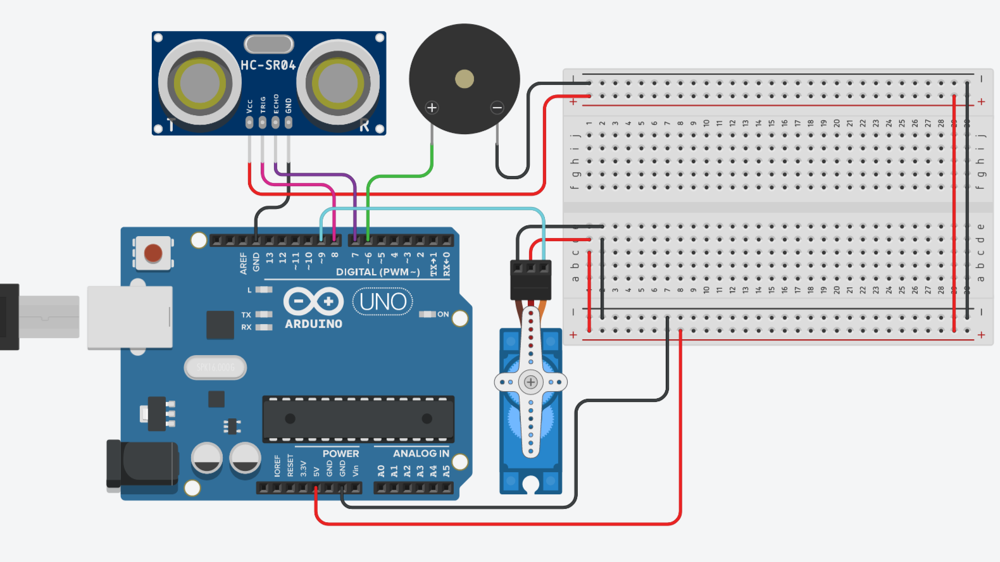

# Project documentation

### Inicial Idea
+ The base idea for this project is a robot with social anxiety, who will scream and eventually pull it's own plug when approached.

### Inicial Sketch
+ The first thing I did was plan my board on [TinkerCAD](https://www.tinkercad.com/), and it went something like this:

### Code
+ I did some research to learn more about the ultrassonic sensor, and then tested my sketch on TinkerCAD, making the necessary alterations to my code.
+ After making sure the basic concept worked, it was time to get my hands dirty and build my project with my physical arduino kit

### Final Product
+ [Project Video](https://youtu.be/Ph2GAeHxKao)
+ Basically the ultrassonic sensor detects when anything gets close, and activates the buzzer.
+ If anything gets past the last threshhold, the servo motor activates and pulls the GND cable, deactivating the whole system.
